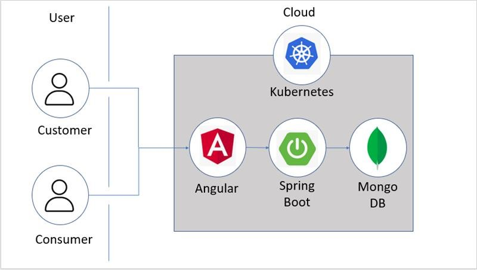
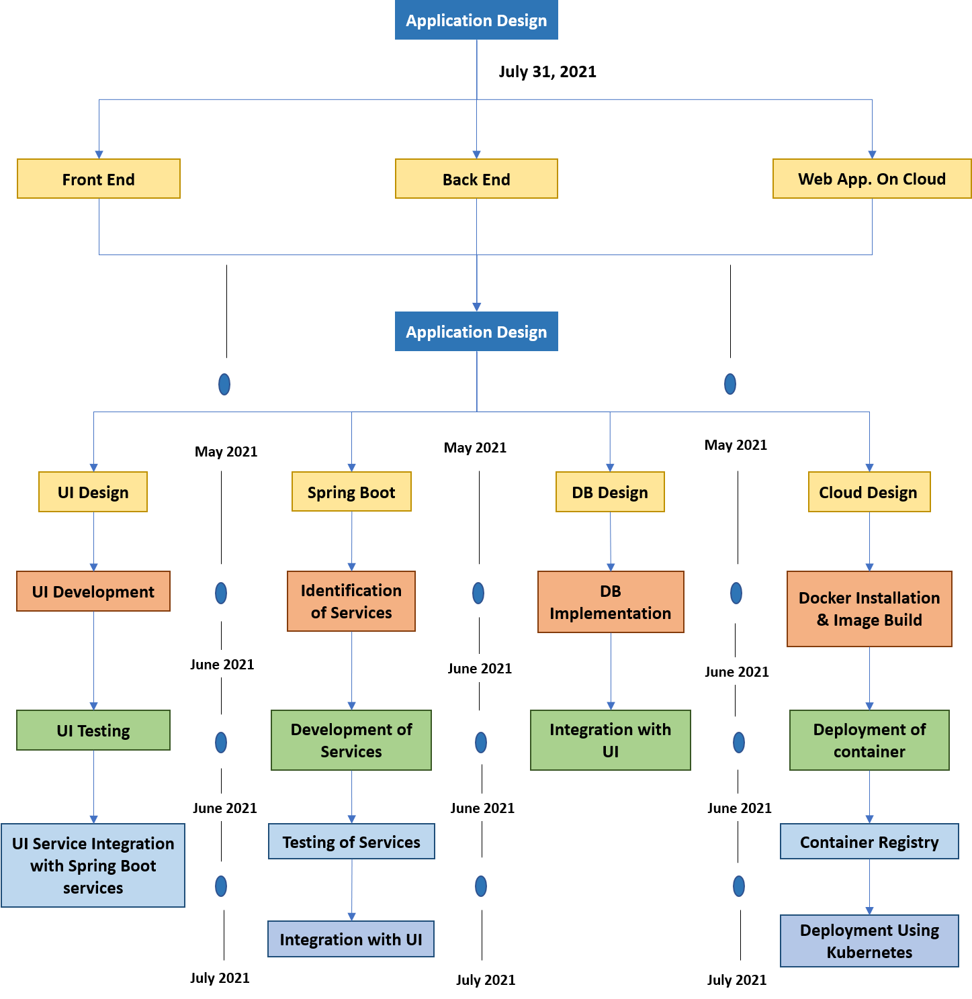

# SATVA

  

### “Don't throw your paper away, it can be effectively reused!”

## Contents

- [SATVA](#satva)
  - [Contents](#contents)
  - [Short description](#short-description)
    - [What's the problem?](#whats-the-problem)
    - [How can technology help?](#how-can-technology-help)
    - [The idea](#the-idea)
  - [Demo video](#demo-video)
  - [The architecture](#the-architecture)
  - [Long description](#long-description)
  - [Project roadmap](#project-roadmap)
  - [Getting started](#getting-started)
  - [Live demo](#live-demo)
  - [Built with](#built-with)
  - [Contributing](#contributing)
  - [Versioning](#versioning)
  - [Authors](#authors)
  - [License](#license)
  - [Acknowledgments](#acknowledgments)

## <a id = "short-description">Short description </a>

### <a id = "whats-the-problem">What's the problem? </a>

Paper recycling is an essential part of the recycling industry. Almost all kinds of paper are recyclable. The most commonly recycled paper items include cardboard, newspaper and magazines etc.

### <a id = "how-can-technology-help">How can technology help? </a>

People can effectively make use of the application which connects the customers to consumers in need of the type of paper available.

### <a id = "the-idea"> The idea </a>

The recycling of paper is the process by which wastepaper is turned into a new paper product. The idea behind our problem solution is recycling paper for saving energy and landfill space. 

## <a id = "demo-video"> Demo video  </a>

## <a id = "the-architecture"> The architecture </a>

1. The customer/consumer logins to the portal via the web application deployed on IBM Cloud Kubernetes Cluster Service.
2. The Web application uses Angular for frontend and Java Spring boot for the backend.
3. The customer and consumer data is stored in Mongo DB.
4. The app connects the customer and consumer via various functionalities.

## <a id = "long-description"> Long description </a>

[More detail is available here](./docs/DESCRIPTION.md)

## <a id = "project-roadmap"> Project roadmap </a>

The project currently does the following things.

- Customer Can Sell Paper and Gain Reward Points
- Consumer Can Buy Paper

It's in a free tier IBM Cloud Kubernetes cluster. In the future we plan to run on Red Hat OpenShift.

See below for our proposed schedule on next steps after Call for Code 2021 submission.

## <a id="getting-started" > Getting started </a>

### Prerequisites

- Install and configure Softwares required to build JAR File.
- Install and configure [nodejs](https://nodejs.org/en/download/).
- Register for an [IBM Cloud](https://www.ibm.com/account/reg/us-en/signup?formid=urx-42793&eventid=cfc-2020?cm_mmc=OSocial_Blog-_-Audience+Developer_Developer+Conversation-_-WW_WW-_-cfc-2020-ghub-starterkit-cooperation_ov75914&cm_mmca1=000039JL&cm_mmca2=10008917) account.
- Install and configure [IBM Cloud CLI](https://cloud.ibm.com/docs/cli?topic=cloud-cli-getting-started#overview).
- Install and configure [Docker](https://docs.docker.com/engine/install/).
- Clone the [repository](https://github.com/Call-for-Code/Solution-Starter-Kit-Cooperation-2020).

### Steps

1. [Build the Frontend code on local](#short-description)
2. [Build the Backend code on local](#2-backend-build).
3. [Copy the built codes to Docker directory](#3-copy-code-to-docker-directory).
4. [Deploy the Web App on IBM Cloud Kubernetes Cluster](#4-deploy-the-app).

